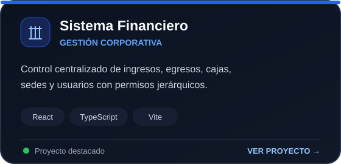
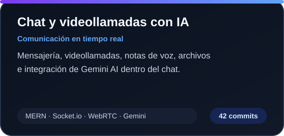
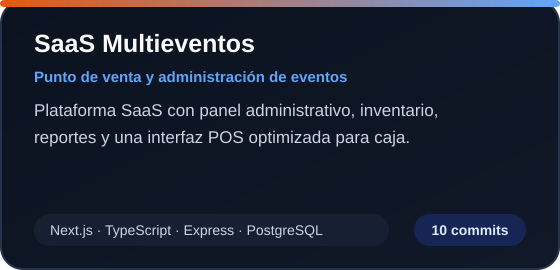

<div align="center">



<br/>

[](./README.md)
[](./README.es.md)

<br/>

<a href="mailto:211181@unamba.edu.pe"></a>
<a href="https://www.linkedin.com/in/luis-loayza-4b79a6276/"></a>
<a href="https://github.com/Terateniente?tab=repositories"></a>

</div>

---

## `01.` Sobre mí

```ts
const luis = {
  rol: "Ingeniero de Software",
  enfoque: ["Full-Stack", "Product Engineering", "UI/UX", "IA"],
  construyendo: "Productos digitales confiables que resuelven problemas reales",
  ubicación: "Apurímac, Perú",
  disponiblePara: ["Roles de software", "Proyectos freelance", "Colaboraciones"]
};
```

Soy bachiller en **Ingeniería Informática y Sistemas**. Construyo productos digitales de principio a fin: desde interfaces claras y reglas de negocio sólidas hasta API, datos y despliegue.

Mi trabajo abarca **frontend, backend, diseño de producto, sistemas en tiempo real e inteligencia artificial**. Disfruto convertir procesos complejos en software fácil de usar, mantener y evolucionar.

> **Actualmente:** construyendo plataformas financieras, productos SaaS y experiencias enfocadas en confiabilidad, rendimiento y usabilidad.

---

## `02.` Capacidades de ingeniería

<table>
  <tr>
    <td colspan="2" align="center" valign="top">
      <a href="https://jjja-interoceanica.vercel.app/"></a>
      <h3>Corporación Interoceánica JJJA — Portal Corporativo</h3>
      <p>Experiencia corporativa responsiva con presentación de servicios, mapa interactivo, equipo, brochure descargable y narrativa visual con animaciones.</p>
      <p><code>React 19</code> <code>Vite</code> <code>Tailwind CSS</code> <code>Motion</code> <code>Leaflet</code></p>
      <a href="https://github.com/Terateniente/Portal_Corporativo_JJJA"></a>
      <a href="https://jjja-interoceanica.vercel.app/"></a>
    </td>
  </tr>
  <tr>
    <td width="33%" valign="top">
      <h3>⚙️ Product Engineering</h3>
      <p>Productos web y móviles, plataformas administrativas, autenticación, permisos, API REST y flujos de negocio.</p>
    </td>
    <td width="33%" valign="top">
      <h3>✦ Ingeniería UI/UX</h3>
      <p>Interfaces responsivas, patrones accesibles, sistemas de diseño, visualización de datos y componentes reutilizables.</p>
    </td>
    <td width="33%" valign="top">
      <h3>⌁ Datos e IA</h3>
      <p>Automatización, procesamiento de información, visión artificial e integración de servicios inteligentes.</p>
    </td>
  </tr>
</table>

---

## `03.` Stack de ingeniería

<div align="center">

**Frontend y producto**


<br/>

**Backend y datos**


<br/>

**Cloud y herramientas**


</div>

---

## `04.` Proyectos destacados

<table>
  <tr>
    <td width="50%" valign="top">
      <a href="https://github.com/Terateniente/Caja-El-Asesor"></a>
      <h3>Plataforma de Gestión Financiera</h3>
      <p>Operación financiera multi-sede con permisos por rol, movimientos, cierres auditables, paneles y reportes.</p>
      <p><code>React</code> <code>Node.js</code> <code>MongoDB</code> <code>Tailwind</code></p>
      <a href="https://github.com/Terateniente/Caja-El-Asesor"></a>
    </td>
    <td width="50%" valign="top">
      <a href="https://github.com/Terateniente/CHAT-Sockeio"></a>
      <h3>CHAT Sockeio</h3>
      <p>Mensajería, notas de voz, archivos, videollamadas, presencia en línea y un asistente de IA integrado.</p>
      <p><code>React</code> <code>Node.js</code> <code>Socket.IO</code> <code>WebRTC</code></p>
      <a href="https://github.com/Terateniente/CHAT-Sockeio"></a>
    </td>
  </tr>
  <tr>
    <td width="50%" valign="top">
      <a href="https://github.com/Terateniente/WIKSAYUQ"></a>
      <h3>WIKSAYUQ</h3>
      <p>Producto móvil para seguimiento prenatal y acompañamiento de pacientes, pensado para comunidades altoandinas.</p>
      <p><code>React Native</code> <code>Expo</code> <code>TypeScript</code> <code>Supabase</code></p>
      <a href="https://github.com/Terateniente/WIKSAYUQ"></a>
    </td>
    <td width="50%" valign="top">
      <a href="https://github.com/Terateniente/SAAS_MULTIEVENTOS"></a>
      <h3>SaaS Multieventos</h3>
      <p>Plataforma SaaS que conecta administración de eventos, inventario, reportes y flujos de punto de venta.</p>
      <p><code>Next.js</code> <code>TypeScript</code> <code>PostgreSQL</code> <code>Supabase</code></p>
      <a href="https://github.com/Terateniente/SAAS_MULTIEVENTOS"></a>
    </td>
  </tr>
</table>

<div align="center">
  <a href="https://github.com/Terateniente?tab=repositories"></a>
</div>

---

## `05.` Actividad en GitHub

<div align="center">

<picture>
  <source media="(prefers-color-scheme: dark)" srcset="https://github-profile-summary-cards.vercel.app/api/cards/profile-details?username=Terateniente&theme=github_dark" />
  <source media="(prefers-color-scheme: light)" srcset="https://github-profile-summary-cards.vercel.app/api/cards/profile-details?username=Terateniente&theme=github" />
  
</picture>

<br/>

<picture>
  <source media="(prefers-color-scheme: dark)" srcset="https://raw.githubusercontent.com/Terateniente/Terateniente/output/github-snake-dark.svg" />
  <source media="(prefers-color-scheme: light)" srcset="https://raw.githubusercontent.com/Terateniente/Terateniente/output/github-snake.svg" />
  
</picture>

</div>

---

## `06.` Construyamos algo con impacto

<div align="center">

Si necesitas crear un producto digital, mejorar una experiencia o convertir un proceso complejo en software mantenible, conversemos.

<br/><br/>

<a href="mailto:211181@unamba.edu.pe"></a>
<a href="https://www.linkedin.com/in/luis-loayza-4b79a6276/"></a>

<br/><br/>

<sub><strong>Diseñado y construido con intención por Luis Loayza.</strong></sub>

</div>
